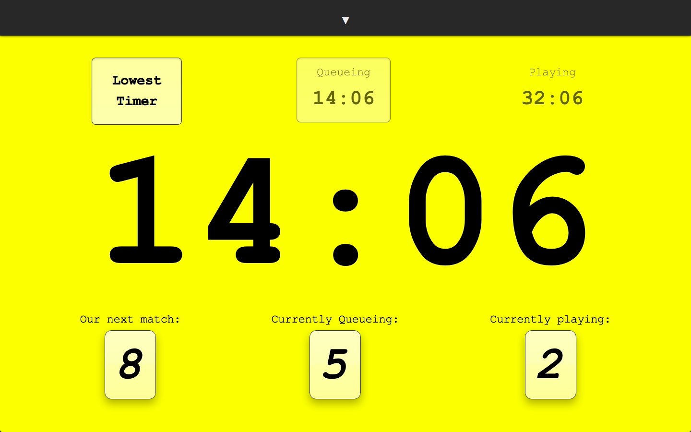

FRC Competition Timer
=====================

The FRC Competition Timer is a Javascript timer to keep track of when your team is up for queueing, playing, and judging during the Qualification matches of an FRC event. As of now it is minimally configurable, but in future it may allow users to set things like the number of matches between queueing and playing, or even detect that automatically from the @frcfms Twitter stream. It will also soon support offline use, since internet access is not available at the competition. When this feature is available, browsers that support the API will be able to visit use the page without internet access as long as they have already visited once with internet access.

This timer was built by [Will Pryor][will] (with help from [Ian Naval][ian]) from [Team 3120: The RoboKnights][roboknights] during the 2012 Las Vegas FRC Regional. We hope you find it useful. If you have problems or contributions, feel free to use GitHub Issues and/or issue a pull request. 

[will]: http://beiju.us/
[ian]: http://http://ianonavy.tumblr.com/
[roboknights]: http://ndroboknights.com/

TODO:
-----
* Make 'now' button trigger input change
* 
* Fix application cache
* Refactor
    - Consolidate into one timer with conditionals to run each function
* Ignore judging if it's too far in the past
* Allow for configuration of how far negative the main timer is allowed to get
* Use opening/closing ceremonies and lunch times to give more accurate estimates
* Possible: integrate with @frcfms on Twitter
    - Automatically update the last known match number and time
    - Possible: Use data about all match times to determine interval (needs outlier detection)